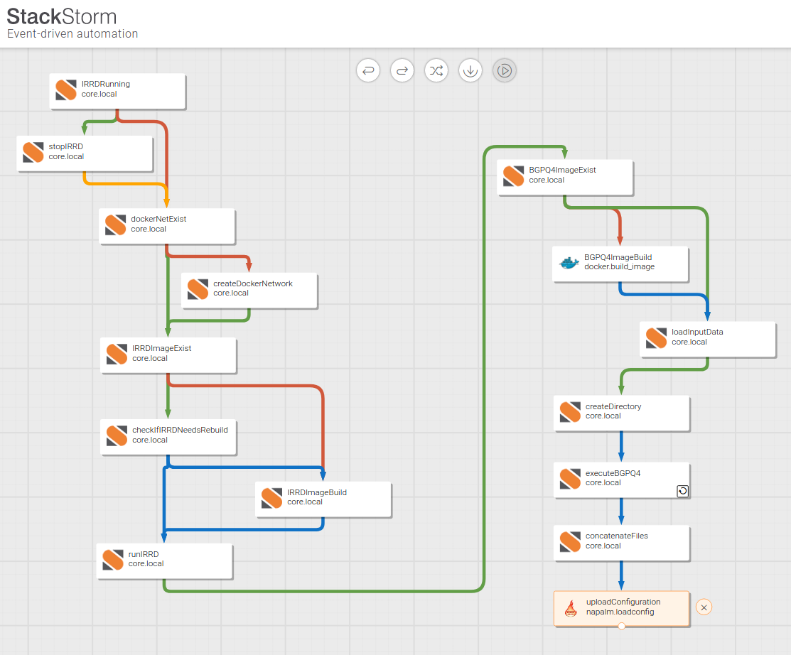

# BGP filter update workflow using Stackstorm
This repo contains a [Stackstorm](https://stackstorm.com "stackstorm") workflow that builds/updates BGP filters for a Juniper router. The process encompasses spinning up two containers; one of them runs a self hosted IRRd instance, mirroring the some routing registries, based on Vincent Bernat's excellent [work](https://vincent.bernat.ch/en/blog/2020-bgpq4-irrd-docker "work"), which is available in his [repository](https://github.com/vincentbernat/irrd-legacy/tree/blade/master "Github"), and the second container hosts the BGPQ4 executable that builds the prefix filter lists querying the local IRR database running in the former container.

The rational behind this work is to demonstrate how such a pipeline may be compiled using off-the-shelf components and a workflow descriptive language. Another benefit arising from the usage of Stackstorm is the availability of triggers and sensors that may be used in the context of a complicated network automation project. Of course, the same result may be easily achieved with a programming language, or other automation tools.

## Workflow steps
The workflow performs the following tasks:
- Terminates the IRRD container if it runs,
- Creates a docker network if doesn't exist,
- Builds the IRRD container if it was built more than 24 hours ago and runs it,
- Builds the BGPQ4 container,
- Parses the config JSON file that describes how the prefix filter should be compiled and follows the following syntax:
```
{
  "as_sets": [
    {
       "as_set": "PUT AS-SET macro name",
       "prefix_list_filter": "Put your prefix list name",
       "inet": "Set to 6 for IPv6 or 4 for IPv4",
       "more_specific_routes_len": "refer to the switch -Z of bgpq4",
       "max_prefix_len": "refer to the switch -m of bgpq4"
    },
...
  ]
}
```
- Iterates over the as_sets macro list and dumps files using as name the `prefix_list_filter` value(s),
- Loads the configuration file to the router using [NAPALM](https://napalm.readthedocs.io/en/latest/ "NAPALM"). A random delay is imposed between uploads to eliminate potential hiccups in the routing process daemon.

The workflow is also illustrated in the next image: 

## Dependencies
The workflow comes as a pack and depends on the availability of the following packs:
- the core pack,
- the napalm pack,
- the docker pack.

## Installation
Firstly and foremost, you need a running Stackstorm instance. The setup was tested using Vagrant; you may install it following the [official instructions](https://docs.stackstorm.com/install/vagrant.html "official instructions").
- Install `jq` in the underlying OS,
- Install `docker`. There is a plethora of tutorials out there to follow,
- Add the Stackstorm user (st2) in the docker group to allow using docker,
- Download and install this pack, alternatively you may install it without downloading by executing: `st2 pack install https://github.com/ymitsos/bgpfilterupdate` inside the VM, it will also install any dependent packs, 
- Edit the `as_sets.json` file and modify it accordingly based on your needs, 
- Make sure a user exists in your router with permissions allowing,  at least, to replace the route filter lists that you defined in the `as_sets.json` file. Trailed below an example of the minimum permissions required under this class for a Juniper router:
```
user@router# show system login class replace-class 
permissions configure;
allow-configuration-regexps "policy-options route-filter-list .*";

```
- Store the user's credentials, needed to login to the router, so as napalm may connect and configure the router following the [instructions](https://github.com/StackStorm-Exchange/stackstorm-napalm/blob/master/README.md),
- Having all these in place, you are ready to execute the action.


## Next steps
The workflow has been tested producing and updating successfully prefix filter lists in a Juniper device. However, for the shake of completeness, the following considerations shall be addresses in forthcoming releases
- Enable logging,
- Handle efficiently failures from different steps of the workflow,
- Create a mechanism to assess the volume of changes of the prefix lists based on a threshold and act accordingly.
